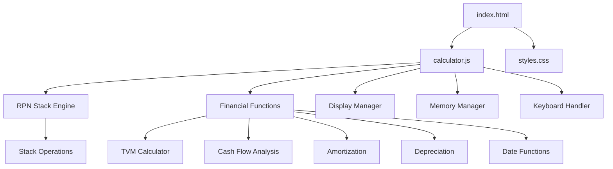

# HP-12C Calculator Implementation Plan

## Overview
Build a fully functional HP-12C financial calculator replica using HTML, CSS, and JavaScript. The calculator will replicate both the visual appearance and complete functionality of the legendary HP-12C, including RPN logic, financial calculations, and all standard operations.

## Technical Architecture

### Component Structure



### Core Modules

#### 1. RPN Stack Engine
- 4-level stack (X, Y, Z, T registers)
- Automatic stack lift/drop
- ENTER key behavior
- Last X register

#### 2. Display Manager
- 10-digit mantissa display
- Scientific notation support
- LED-style visual appearance
- Stack level indicators

#### 3. Financial Functions Module
- **TVM (Time Value of Money)**
  - n (number of periods)
  - i (interest rate)
  - PV (present value)
  - PMT (payment)
  - FV (future value)
  
- **Cash Flow Analysis**
  - CF0 through CFj
  - NPV (Net Present Value)
  - IRR (Internal Rate of Return)
  
- **Amortization**
  - Amortization schedule
  - Principal and interest calculations
  
- **Depreciation**
  - SL (Straight Line)
  - DB (Declining Balance)
  - SOYD (Sum of Years Digits)
  
- **Date Calculations**
  - Date arithmetic
  - Days between dates

#### 4. Memory Manager
- 20 storage registers (R0-R19)
- STO/RCL operations
- Register arithmetic (STO+, STO-, STO×, STO÷)

## File Structure

```
HP-12C/
├── index.html           # Main HTML structure
├── css/
│   └── styles.css      # Calculator styling
├── js/
│   ├── calculator.js   # Main calculator controller
│   ├── rpn-stack.js   # RPN stack engine
│   ├── financial.js   # Financial calculations
│   ├── display.js     # Display management
│   ├── memory.js      # Memory registers
│   └── keyboard.js    # Keyboard input handler
├── docs/
│   ├── user-guide.md  # User documentation
│   └── examples.md    # Example calculations
├── tests/
│   └── test-cases.md  # Test scenarios
├── plans/
│   └── hp12c-implementation-plan.md
└── README.md          # Project overview
```

## Git Commit Strategy

### Phase 1: Foundation
1. **Commit 1**: Initialize project with README and basic structure
2. **Commit 2**: Create HTML layout with all calculator buttons
3. **Commit 3**: Implement basic CSS styling for HP-12C appearance

### Phase 2: Core Calculator
4. **Commit 4**: Build RPN stack engine with display
5. **Commit 5**: Implement basic arithmetic operations
6. **Commit 6**: Add stack operations (ENTER, CLx, R↓, x↔y)
7. **Commit 7**: Implement memory registers

### Phase 3: Mathematical Functions
8. **Commit 8**: Add basic math functions (√x, x², 1/x)
9. **Commit 9**: Implement percentage functions (%, Δ%)
10. **Commit 10**: Add logarithmic and exponential functions

### Phase 4: Financial Functions - TVM
11. **Commit 11**: Implement TVM calculation engine
12. **Commit 12**: Add n, i, PV functions
13. **Commit 13**: Add PMT and FV functions
14. **Commit 14**: Test and validate TVM calculations

### Phase 5: Financial Functions - Cash Flow
15. **Commit 15**: Implement cash flow storage (CF0, CFj)
16. **Commit 16**: Add NPV calculation
17. **Commit 17**: Implement IRR calculation with Newton-Raphson method

### Phase 6: Advanced Financial Functions
18. **Commit 18**: Implement amortization functions
19. **Commit 19**: Add date calculation functions
20. **Commit 20**: Implement depreciation functions

### Phase 7: Polish and Documentation
21. **Commit 21**: Add keyboard support and shortcuts
22. **Commit 22**: Implement button press animations
23. **Commit 23**: Create interactive help system
24. **Commit 24**: Add user guide and examples
25. **Commit 25**: Final testing and bug fixes

## HP-12C Button Layout

```
┌─────────────────────────────────────┐
│  HP-12C                             │
│  ┌───────────────────────────────┐  │
│  │                       0.      │  │ Display
│  └───────────────────────────────┘  │
│                                     │
│  [n]  [i]  [PV] [PMT] [FV]         │
│  [f]  [g]  [STO][RCL][R/S]         │
│  [SST][Rⓥ] [x↔y][CLx][ENTER]      │
│  [-]  [7]  [8]  [9]  [÷]           │
│  [+]  [4]  [5]  [6]  [×]           │
│  [-]  [1]  [2]  [3]  [-]           │
│  [ON] [0]  [.]  [Σ+] [+]           │
└─────────────────────────────────────┘
```

## Key Implementation Details

### RPN Stack Behavior
- Operands entered first, operators last
- ENTER duplicates X into Y (stack lift)
- Operators consume X and Y, result in X
- Stack drops automatically after operations

### Display Formatting
- Standard: 10 digits with decimal point
- Scientific: e.g., "1.234567890 E-12"
- Negative numbers: leading minus sign
- Overflow: display "9.999999999 E99"

### Financial Calculation Algorithms

#### TVM Calculation
Uses iterative Newton-Raphson method for interest rate:
```
PV + PMT×[(1-(1+i)^-n)/i] + FV×(1+i)^-n = 0
```

#### IRR Calculation
Newton-Raphson iteration:
```
NPV = Σ[CFj / (1+IRR)^j] = 0
```

## Testing Strategy

### Unit Tests
- RPN stack operations
- Each arithmetic operation
- Memory register operations
- Stack lift/drop behavior

### Integration Tests
- Complete calculation sequences
- Financial function workflows
- TVM scenarios

### Validation Test Cases
Use known HP-12C examples from the manual:
1. Loan payment calculation
2. Mortgage amortization
3. Investment NPV
4. Bond yield calculations
5. Depreciation schedules

## User Interface Features

### Visual Feedback
- Button press animation (slight shadow/scale)
- "Running" indicator for long calculations
- Error messages (e.g., "Error 0" for math errors)

### Help System
- Hover tooltips for each button
- Quick reference panel (toggleable)
- Example calculations linked to buttons
- Keyboard shortcut indicators

### Keyboard Mapping
- Numbers: 0-9
- Operations: +, -, *, /
- Enter: Enter/Return
- Clear: Escape or Delete
- Decimal: Period (.)
- Special keys mapped to logical alternatives

## Styling Guidelines

### Color Scheme
- Body: Dark brown/black (#2B1810)
- Display: LCD green (#7FAF3F on #3B442C)
- Button background: Golden brown (#8B6B47)
- Button text: White/Cream
- Special keys (gold plate): Gold accent (#D4AF37)
- Blue shift keys: Blue accent (#4A6FA5)

### Typography
- Display: Monospace, LED-style font
- Buttons: Sans-serif, bold
- Documentation: Clean, readable sans-serif

### Dimensions
- Calculator: ~400px width (responsive)
- Display: ~360px × 50px
- Buttons: ~60px × 40px with 5px spacing
- Border radius: Slight rounding for vintage feel

## Browser Compatibility
Target modern browsers:
- Chrome/Edge 90+
- Firefox 88+
- Safari 14+

Use vanilla JavaScript (no framework dependencies) for maximum compatibility and simplicity.

## Future Enhancements (Post-MVP)
- Local storage for saving calculator state
- Multiple calculator "memory sheets"
- Printing calculation tape
- Export calculations to CSV
- Mobile-responsive touch interface
- Sound effects for button presses
- Customizable themes (HP-15C, HP-11C variants)

## Resources and References
- HP-12C Owner's Handbook and Problem-Solving Guide
- HP-12C Solutions Handbook
- Financial calculator algorithms documentation
- RPN calculator behavior specifications

## Success Criteria
- Visual appearance closely matches HP-12C
- All basic arithmetic operations work correctly
- RPN stack behavior is accurate
- All TVM functions calculate correctly
- NPV and IRR calculations match HP-12C results
- User guide provides clear usage instructions
- Keyboard input works smoothly
- Responsive design works on desktop and tablet
