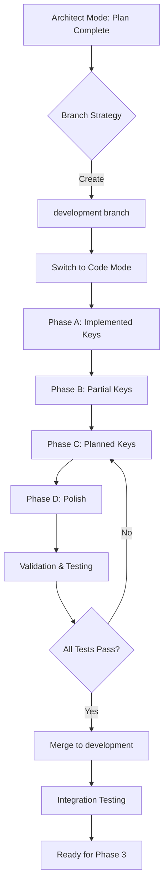

# Phase 2: Key Metadata Implementation - Summary & Recommendations

## Completed Architecture Work

### 1. Analysis Complete ✅

I've analyzed the entire HP-12C calculator codebase and extracted:

- **All 39 physical keys** from [`index.html`](../index.html:48-222)
- **Current data-key values** (inconsistent naming identified)
- **Standardized naming convention** for all keys
- **Implementation status** for each key (implemented/partial/planned)
- **Complete metadata schema** with all required fields

### 2. Design Documents Created ✅

**Key Document:** [`plans/key-metadata-design.md`](key-metadata-design.md)

This comprehensive 500+ line document includes:

#### Complete Key Inventory
- Full table of all 39 keys with current data-key values
- Standardized naming mapping (e.g., `PV` → `pv`, `7` → `digit-7`)
- Gold and blue shifted functions for each key
- Category classification

#### Metadata Schema
- Complete field structure with types
- 14 category enums (financial, arithmetic, stack, etc.)
- 5 implementation status values
- Validation requirements

#### Implementation Examples
- **Fully implemented key:** [`digit-7`](key-metadata-design.md#41-fully-implemented-digit-key) - Complete example with all fields
- **Arithmetic operation:** [`op-add`](key-metadata-design.md#42-fully-implemented-arithmetic-operation) - RPN operation example
- **Partially implemented:** [`chs`](key-metadata-design.md#43-partially-implemented-change-sign) - Honest status documentation
- **Planned function:** [`n`](key-metadata-design.md#44-planned-financial-function) - TVM key with extensive educational content

#### File Structure
- Complete JavaScript template
- Validation functions
- Utility functions for querying metadata
- Load order requirements

### 3. Implementation Status Mapping ✅

| Status | Count | Keys |
|--------|-------|------|
| **✅ Implemented** | 17 | All digits (0-9), decimal, arithmetic (+−×÷), stack (ENTER, CLx, R↓, x↔y), control (ON, f, g) |
| **⚙️ Partially** | 3 | CHS, STO, RCL (logic exists, not wired) |
| **⚠️ Planned** | 19 | Financial (n, i, pv, pmt, fv), scientific (yˣ, 1/x, %, etc.), programming, statistics |

### 4. Quality Standards Defined ✅

Each metadata entry must be:
- **Accurate** - Matches real HP-12C behavior
- **Honest** - Clear about implementation status
- **Educational** - Helps users learn
- **Complete** - All required fields present
- **Consistent** - Follows conventions
- **Helpful** - Practical examples and tips

## Git Branching Strategy Recommendation

Based on your feedback about keeping main stable, here's the recommended approach:

### Option 1: Feature Branch Workflow (Recommended)

```bash
# Current state
main (stable, working calculator)
  ↓
development (new branch for Phase 2)
  ↓
feature/key-metadata (this specific work)
```

**Commands:**
```bash
# 1. Rename remote master to main (if needed)
git branch -m master main
git push -u origin main
git push origin --delete master  # if old master exists

# 2. Create development branch
git checkout -b development
git push -u origin development

# 3. Create feature branch for this work
git checkout -b feature/educational-layer-phase2
git push -u origin feature/educational-layer-phase2
```

**Workflow:**
1. Work on `feature/educational-layer-phase2`
2. Commit frequently with descriptive messages
3. When Phase 2 complete → merge to `development`
4. Test thoroughly on `development`
5. When all phases complete → merge `development` to `main`

### Option 2: Simplified Approach

```bash
# Just create development branch
git checkout -b development
git push -u origin development
```

**Workflow:**
1. Work directly on `development`
2. Keep `main` as last stable release
3. Merge `development` → `main` when ready to release

## Recommended Next Steps

### Immediate Actions

1. **Choose branching strategy** (Option 1 or 2)
2. **Create branches** using commands above
3. **Switch to Code mode** to begin implementation
4. **Start with implemented keys** (easiest, set pattern for others)

### Implementation Phases

#### Phase A: Foundation (2-3 hours)
- Create `js/key-metadata.js` file skeleton
- Implement 17 **fully implemented keys**
  - Digits 0-9 (10 keys)
  - Decimal point (1 key)
  - Arithmetic +−×÷ (4 keys)
  - Stack operations ENTER, CLx (2 keys)
- Test file loads without errors
- Validate structure

#### Phase B: Expansion (2-3 hours)
- Add 3 **partially implemented keys** (CHS, STO, RCL)
- Add 11 **remaining implemented keys**
  - R↓, x↔y (2 stack keys)
  - ON, f, g (3 control/prefix keys)
  - Add educational content
- Validate completeness

#### Phase C: Planned Keys (6-8 hours)
- Add 5 **financial keys** (n, i, pv, pmt, fv)
- Add 6 **scientific keys** (yˣ, 1/x, %, %T, Δ%, EEX)
- Add 3 **programming keys** (R/S, SST, etc.)
- Add 5 **remaining keys**
- Research HP-12C manual for accuracy

#### Phase D: Polish (2 hours)
- Run validation scripts
- Add rich educational content
- Review consistency
- Test all entries
- Documentation

### Total Estimated Time: 12-16 hours

## Diagram: Implementation Flow



## Key Benefits of This Approach

### For Development
- **Non-breaking** - Works on branch, main stays stable
- **Iterative** - Can test after each phase
- **Reversible** - Easy to rollback if issues found
- **Reviewable** - Clear commit history shows progress

### For Users
- **Honest** - Clear implementation status
- **Educational** - Rich learning content
- **Organized** - Consistent structure
- **Searchable** - Can query by category/status

### For Future Development
- **Extensible** - Easy to add new keys/functions
- **Maintainable** - Clear structure and validation
- **Documented** - Self-documenting schema
- **Testable** - Built-in validation functions

## Questions to Resolve

Before proceeding to Code mode:

1. **Branch Strategy**: Option 1 (feature branches) or Option 2 (development only)?
2. **Branch Naming**: Accept my suggestion or prefer different names?
3. **Implementation Pace**: Do all phases at once, or phase by phase with reviews?
4. **Reference Material**: Do you have HP-12C manual, or should I use community docs?

## Recommended Action

I recommend **switching to Code mode** to begin implementation once you've:

1. ✅ Created the development branch
2. ✅ Decided on branching approach
3. ✅ Confirmed you're ready to proceed

The architecture is complete and solid. The next step is execution - translating this plan into the actual `js/key-metadata.js` file with all 39 keys fully documented.

---

**Status:** Architecture phase complete ✅  
**Next Phase:** Code implementation  
**Mode Recommendation:** Switch to Code mode  
**Git Recommendation:** Create development branch first
