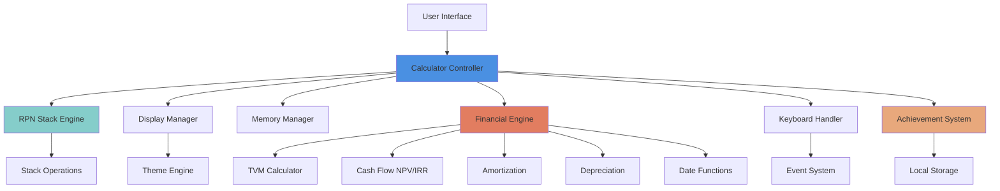
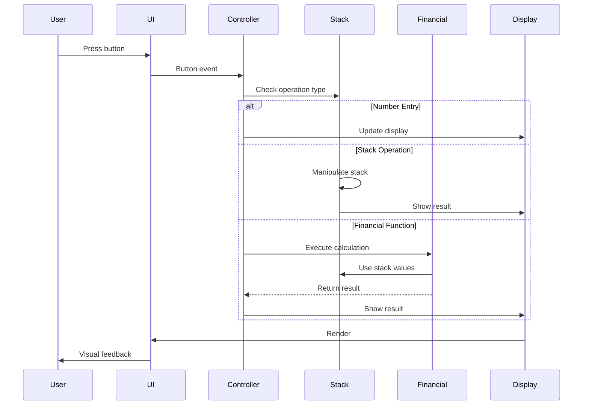
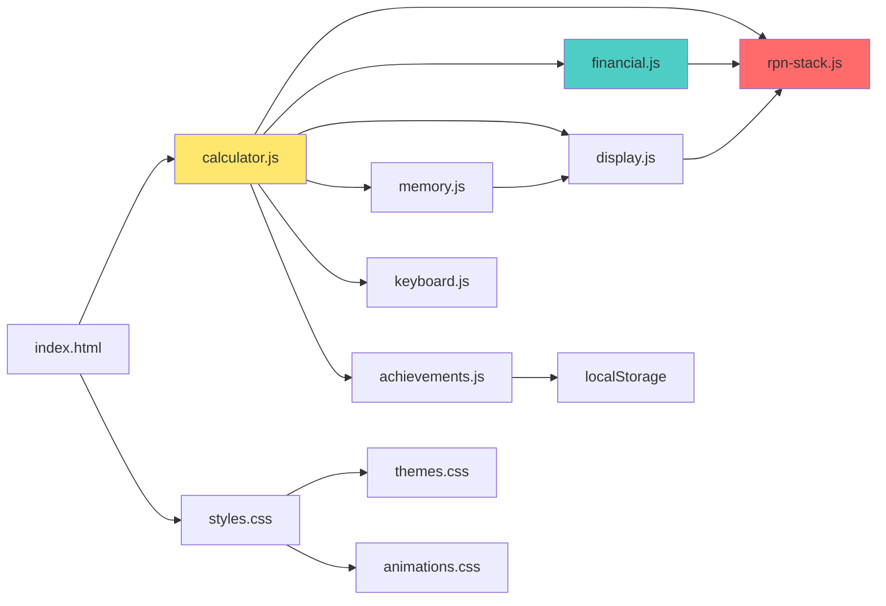
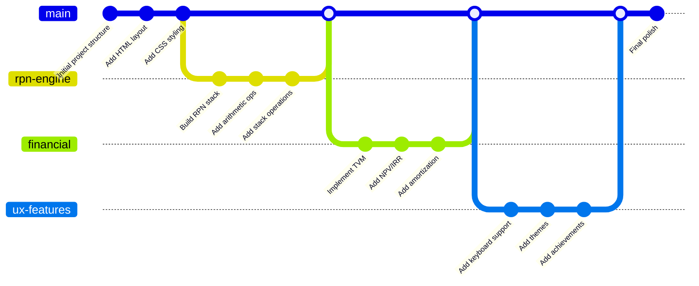
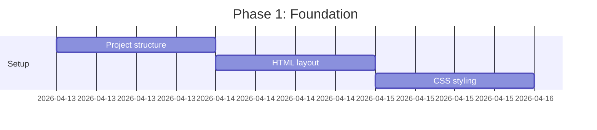
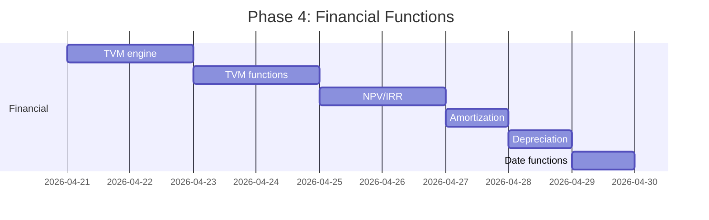
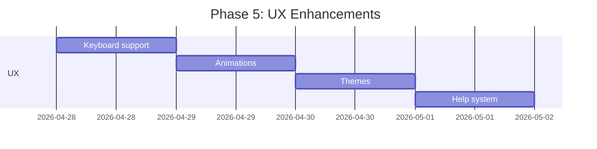
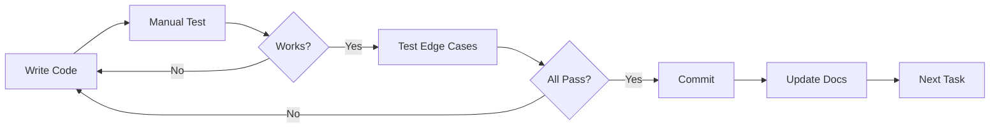

# HP-12C Project Summary

## 🎯 Project Vision

Create a fully functional, visually authentic, and delightfully engaging web-based HP-12C financial calculator that honors the legendary original while adding modern enhancements that make learning and using it fun.

## 📋 Executive Summary

**What**: A complete HP-12C financial calculator simulator  
**How**: Vanilla HTML/CSS/JavaScript with no dependencies  
**Why**: Educational tool, professional utility, and nostalgic tribute  
**Special**: Gamification, themes, achievements, and interactive learning  

## 🏗️ Architecture Overview

### System Architecture



### Data Flow



### Module Dependencies



## 📦 Deliverables

### Phase 1: Foundation
1. ✅ Project structure and documentation
2. HTML calculator layout
3. CSS styling (vintage HP-12C look)
4. Basic JavaScript framework

### Phase 2: Core Calculator
5. RPN stack engine
6. Basic arithmetic operations
7. Stack manipulation functions
8. Display management system

### Phase 3: Advanced Math
9. Mathematical functions (sqrt, power, log, etc.)
10. Percentage calculations
11. Memory register system

### Phase 4: Financial Functions
12. TVM engine (n, i, PV, PMT, FV)
13. NPV calculation
14. IRR calculation (Newton-Raphson)
15. Amortization functions
16. Depreciation methods
17. Date calculations

### Phase 5: User Experience
18. Keyboard support
19. Button animations
20. Theme system
21. Sound effects (optional)

### Phase 6: Gamification
22. Achievement system
23. Daily challenges
24. Progress tracking
25. Interactive tutorials

### Phase 7: Polish
26. Help system
27. User documentation
28. Test suite validation
29. Performance optimization
30. Final bug fixes

## 🔄 Git Commit Strategy

### Commit Flow



### Commit Categories

| Category | Prefix | Example |
|----------|--------|---------|
| Feature | `feat:` | `feat: add TVM calculator` |
| Fix | `fix:` | `fix: correct IRR iteration` |
| Docs | `docs:` | `docs: update user guide` |
| Style | `style:` | `style: improve button layout` |
| Test | `test:` | `test: add NPV test cases` |
| Refactor | `refactor:` | `refactor: simplify stack code` |

## 📊 Implementation Phases

### Phase 1: Foundation (Days 1-2)
**Goal**: Project skeleton and basic structure



**Commits**: 3  
**Deliverables**: Working UI with no functionality

### Phase 2: Core Calculator (Days 3-5)
**Goal**: Basic RPN calculator works


**Commits**: 4-7  
**Deliverables**: Functional basic calculator

### Phase 3: Math Functions (Days 6-7)
**Goal**: Scientific calculator level


**Commits**: 8-10  
**Deliverables**: Complete math calculator

### Phase 4: Financial Functions (Days 8-12)
**Goal**: Full financial calculator



**Commits**: 11-20  
**Deliverables**: Complete HP-12C functionality

### Phase 5: UX Enhancements (Days 13-15)
**Goal**: Polished user experience



**Commits**: 21-24  
**Deliverables**: Professional polish

### Phase 6: Fun Features (Days 16-18)
**Goal**: Engagement and delight


**Commits**: 25-27  
**Deliverables**: Gamification complete

## 🎯 Success Metrics

### Technical Metrics
- [ ] All arithmetic operations accurate to 10 decimal places
- [ ] TVM calculations match HP-12C manual examples
- [ ] NPV/IRR calculations verified against test cases
- [ ] Performance: Button response < 50ms
- [ ] Performance: Financial calculations < 500ms
- [ ] No console errors or warnings
- [ ] Works in Chrome, Firefox, Safari, Edge

### User Experience Metrics
- [ ] Intuitive first-time user experience
- [ ] Clear visual feedback on all interactions
- [ ] Helpful error messages
- [ ] Responsive design works on all screen sizes
- [ ] Keyboard shortcuts feel natural
- [ ] Themes enhance, not distract

### Educational Metrics
- [ ] Quick start guide teaches RPN in 5 minutes
- [ ] Examples cover all major use cases
- [ ] Help system provides context-sensitive assistance
- [ ] Tutorials guide users through learning curve

## 🔧 Development Workflow

### Daily Workflow
1. Review current phase goals
2. Select next todo item
3. Implement feature
4. Test thoroughly
5. Commit with clear message
6. Update documentation
7. Move to next item

### Testing Workflow


### Code Review Checklist
- [ ] Code is clean and readable
- [ ] Functions are well-commented
- [ ] No hardcoded values
- [ ] Error handling in place
- [ ] Performance considerations
- [ ] Follows project style guide
- [ ] Documentation updated

## 📚 Documentation Structure

### User Documentation
- **README.md**: Project overview and quick start
- **quick-start-guide.md**: RPN basics and first calculations
- **examples.md**: 48 real-world examples
- **user-guide.md**: Complete function reference

### Developer Documentation
- **technical-spec.md**: Algorithms and implementation details
- **hp12c-implementation-plan.md**: Architecture and strategy
- **project-summary.md**: This document

### Fun Documentation
- **fun-features.md**: Gamification ideas and implementation

## 🚀 Deployment Strategy

### Local Development
```bash
# Simple: Just open index.html
open index.html
```

### GitHub Pages
```bash
# Push to gh-pages branch
git checkout -b gh-pages
git push origin gh-pages
# Enable in GitHub repository settings
```

### Static Hosting
- Netlify: Drag and drop deployment
- Vercel: Connect GitHub repository
- GitHub Pages: Automatic from main branch

## 🎨 Design Principles

### Visual Design
1. **Authenticity**: Looks like real HP-12C
2. **Clarity**: Easy to read and understand
3. **Responsiveness**: Works on all devices
4. **Delightful**: Small touches of joy

### Code Design
1. **Modularity**: Clear separation of concerns
2. **Readability**: Code is self-documenting
3. **Maintainability**: Easy to modify and extend
4. **Performance**: Smooth and responsive

### User Experience
1. **Intuitive**: Works as expected
2. **Forgiving**: Easy to recover from mistakes
3. **Educational**: Helps users learn
4. **Engaging**: Fun to use

## 🎓 Learning Path for Users

### Beginner (Week 1)
1. Understand RPN basics
2. Master arithmetic operations
3. Learn stack operations
4. Practice with examples

### Intermediate (Week 2)
5. Learn percentage functions
6. Understand memory registers
7. Practice chain calculations
8. Complete daily challenges

### Advanced (Week 3-4)
9. Master TVM calculations
10. Learn NPV/IRR analysis
11. Understand amortization
12. Apply to real scenarios

## 🔐 Security Considerations

### Client-Side Only
- No server communication
- No data leaves browser
- No authentication needed
- Privacy friendly

### Data Storage
- Local storage only
- No cookies
- No tracking
- User controls all data

### Input Validation
- Validate all numeric inputs
- Prevent XSS through display
- Handle overflow/underflow
- Graceful error handling

## 🌟 Unique Selling Points

1. **Most Complete**: Full HP-12C functionality
2. **Most Beautiful**: Authentic design with modern polish
3. **Most Fun**: Unique gamification features
4. **Most Educational**: Best learning resources
5. **Most Accessible**: Works everywhere, no install
6. **Most Authentic**: True RPN behavior
7. **Most Modern**: Contemporary web technologies

## 📈 Future Possibilities

### Version 2.0
- Progressive Web App (offline support)
- Mobile apps (iOS/Android)
- Cloud sync for settings
- Collaboration features
- Print calculation tape
- Export to PDF/CSV

### Calculator Variants
- HP-15C (scientific)
- HP-11C (simplified)
- HP-16C (programmer)
- Custom calculator builder

### Educational Platform
- Interactive courses
- Certification program
- Teacher resources
- Student competition

## 🎉 Making It Special

### What Makes This Project Stand Out
- ❤️ **Love for Detail**: Every pixel matches the original
- 🧠 **Smart Features**: Helpful without being intrusive
- 🎮 **Gamification Done Right**: Fun but not childish
- 📚 **Documentation Excellence**: Clear and comprehensive
- 🎨 **Design Excellence**: Beautiful and functional
- 💻 **Code Quality**: Clean, maintainable, extensible

### Why People Will Love It
- Finance students preparing for exams
- Professionals doing quick calculations
- Calculator enthusiasts exploring RPN
- Educators teaching financial concepts
- Nostalgia seekers reliving 80s technology
- Anyone who appreciates great design

## 📞 Project Contact

**Repository**: (to be created)  
**Documentation**: docs/  
**Issues**: GitHub Issues  
**Discussions**: GitHub Discussions  

---

## ✅ Ready to Build?

This comprehensive plan provides:
- ✅ Clear architecture
- ✅ Detailed implementation strategy
- ✅ Git commit workflow
- ✅ Complete documentation
- ✅ Success metrics
- ✅ Testing strategy

**Next Step**: Switch to Code mode and start implementing!

**Recommended Starting Order**:
1. Commit 1: Initialize project with README
2. Commit 2: Create HTML structure
3. Commit 3: Add CSS styling
4. Commit 4: Build RPN stack engine
5. Continue through implementation phases...

---

*Let's build something awesome! 🚀*
