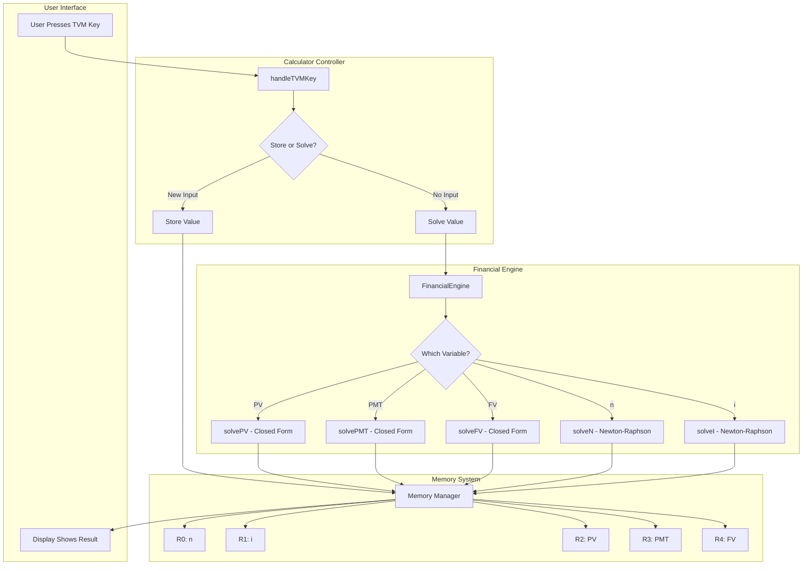
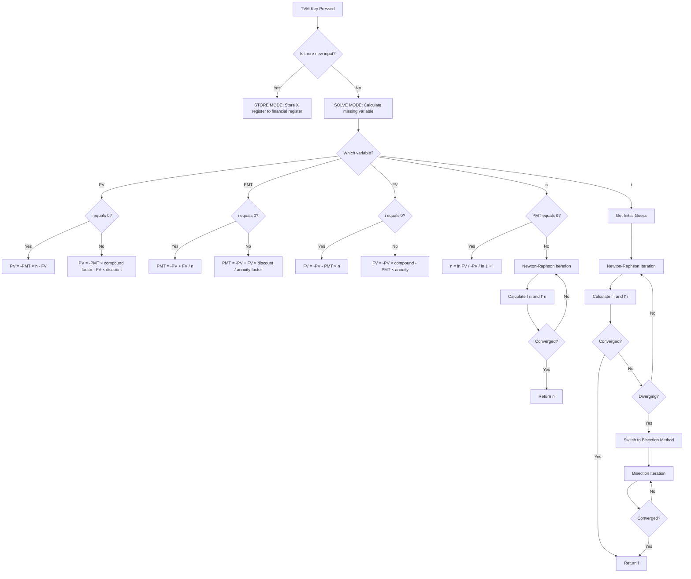
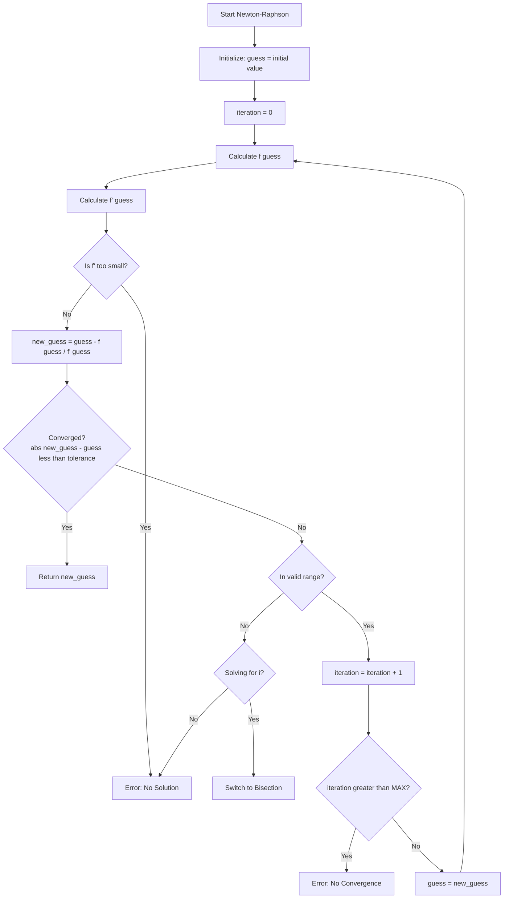
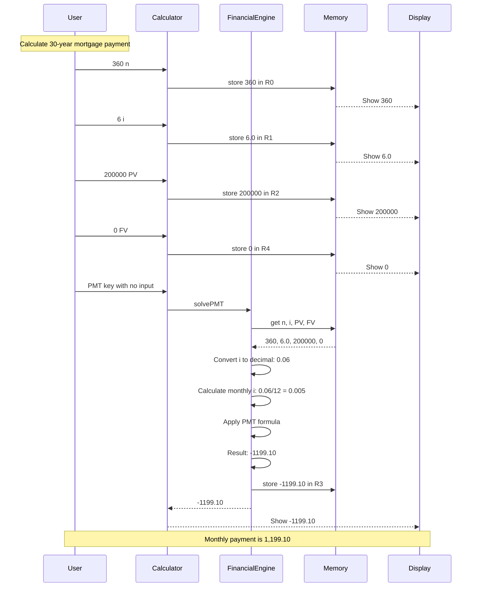
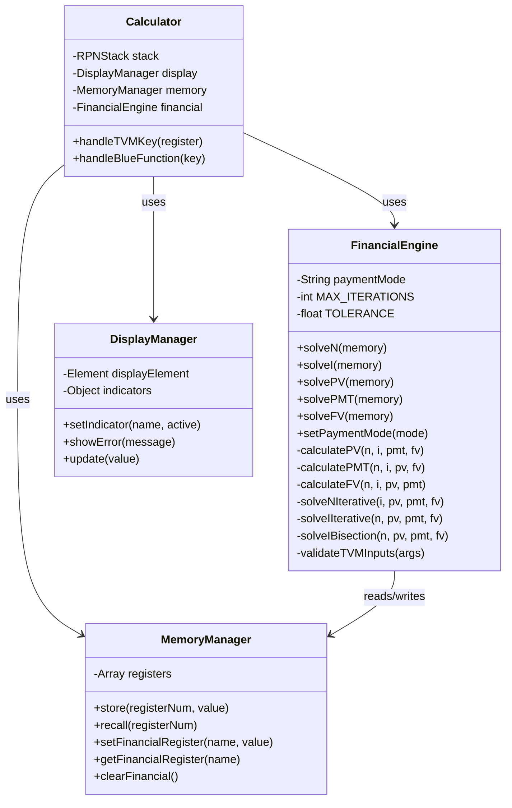
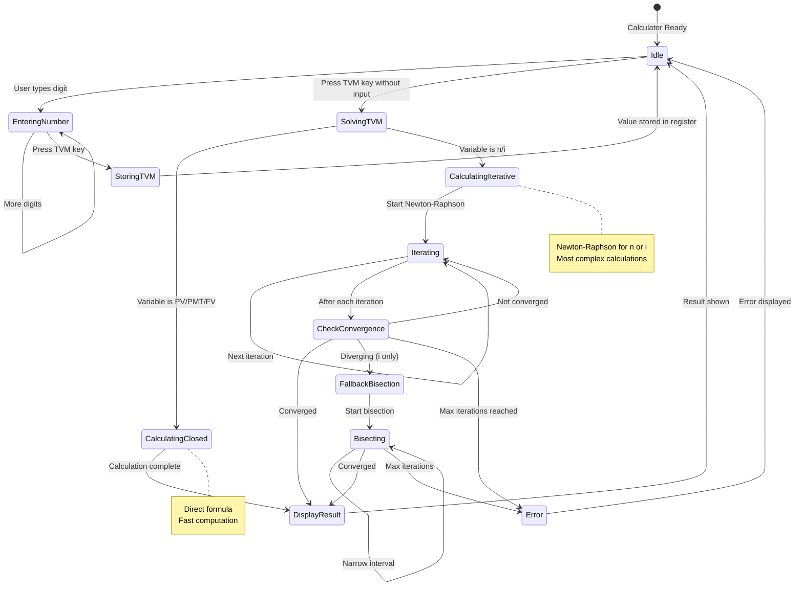
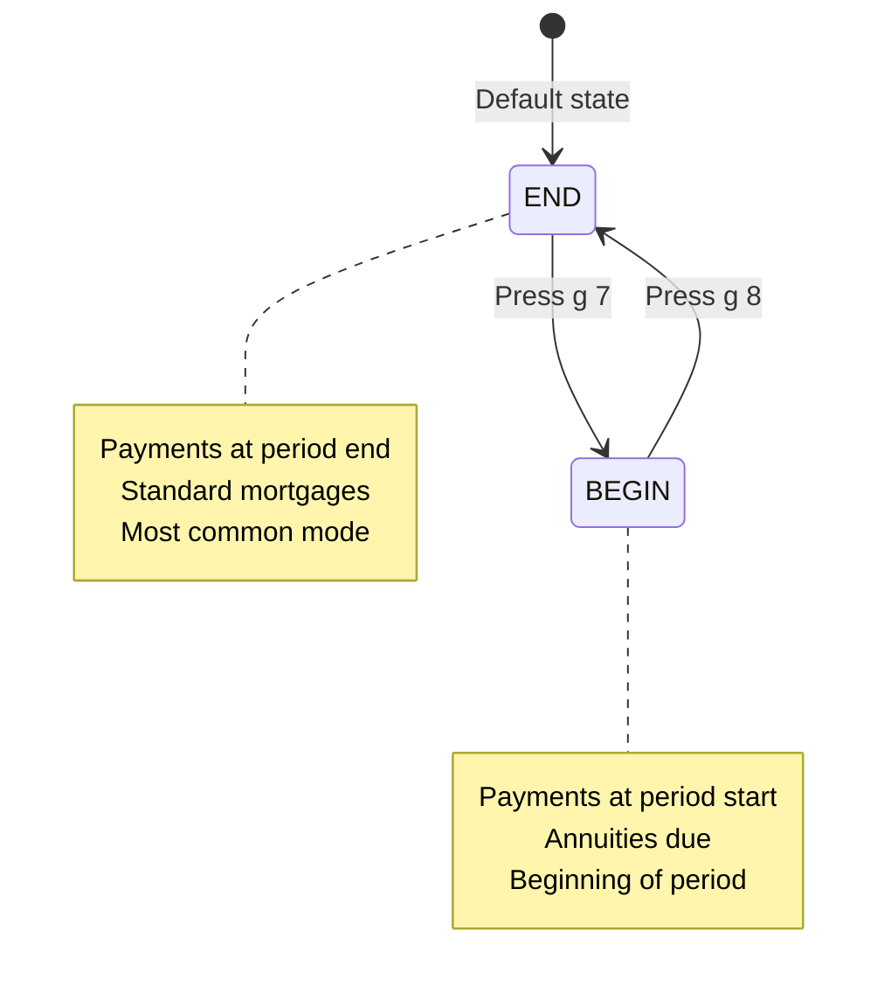
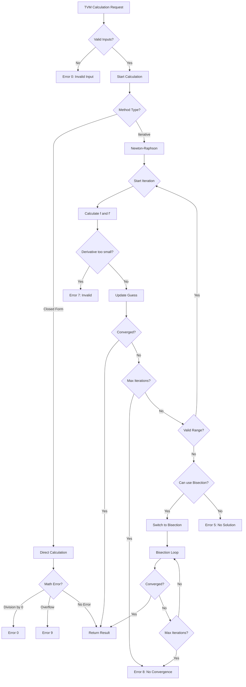

# Financial TVM - Visual Architecture Diagrams

## System Component Interaction

## TVM Solver Decision Tree

## Newton-Raphson Algorithm Flow

## Data Flow Example: Mortgage Calculation

## Class Structure Diagram

## State Transition Diagram

## Payment Mode State

## Error Handling Flow

---

## Legend

### Diagram Types
- **Graph TB**: Top-to-bottom flow diagrams
- **sequenceDiagram**: Time-based interactions
- **classDiagram**: Object-oriented structure
- **stateDiagram**: State machine transitions

### Color Coding (conceptual)
- 🟦 **Blue**: User interaction points
- 🟩 **Green**: Successful completion paths
- 🟨 **Yellow**: Decision points
- 🟥 **Red**: Error states

### Key Concepts
- **Closed-form**: Direct mathematical formula, fast (< 1ms)
- **Iterative**: Newton-Raphson or bisection, slower (< 100ms)
- **Convergence**: When iterative solver finds accurate answer
- **Bisection**: Fallback method when Newton-Raphson fails

---

*These diagrams show the complete architecture of the TVM implementation. Use them as reference during coding.*
